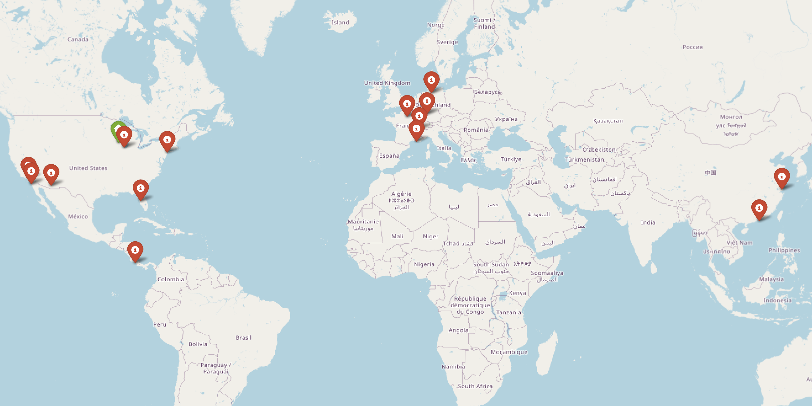
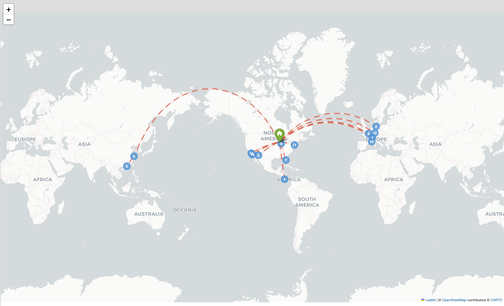
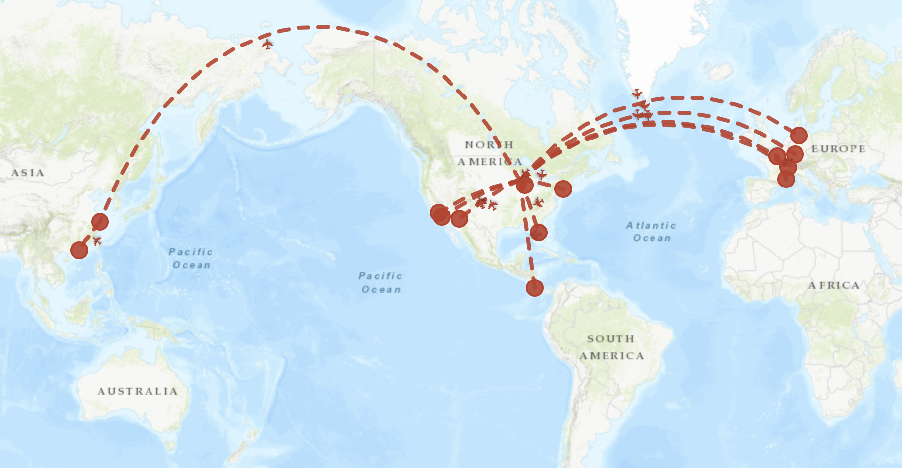
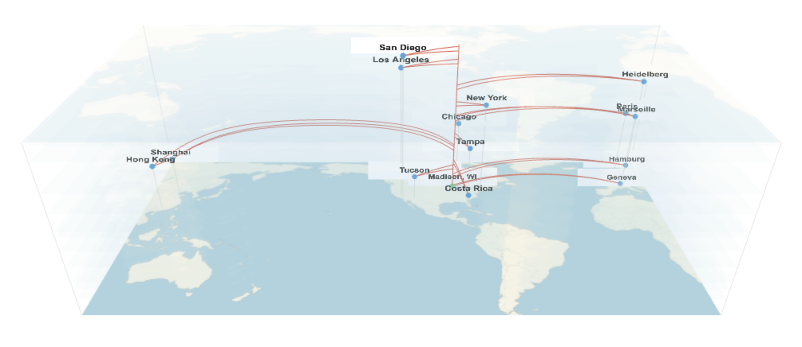

# Travel Map

Generate beautiful travel maps from YAML configuration files. Features multiple visual styles including classic pins, arcs, Indiana Jones-inspired vintage maps, and interactive 3D worldline visualizations.

**[View Live Demos](https://theoryandpractice.org/travel-map/)**

| Pins | Arcs |
|:---:|:---:|
|  |  |
| **Indiana Jones** | **Worldline 3D** |
|  |  |

## Installation

```bash
# Using pixi (recommended)
pixi install

# Or using pip
pip install -e .
```

## Quick Start

```bash
# Generate a map from a YAML config
travel-map generate trip.yml

# Preview in browser
travel-map preview trip.yml

# Generate from geotagged photos
travel-map from-photos ./vacation_photos -o trip.yml
```

## Web UI（输入地区 + 景点列表，自动生成地图）

在界面上输入一个地区（国家 / 省 / 市 / 县 / 乡）和一批景点名，系统会高亮该地区、标记景点，并可一键导出图片。可选接入阿里百炼（DashScope）大模型来做自然语言理解（地区简称规范化 + 景点经纬度）。

```bash
# 启动 Web 界面（默认 http://127.0.0.1:8000）
travel-map serve
travel-map serve --port 8000
```

### 接入百炼大模型（可选）

1. 在项目根目录创建 `.env`（已加入 `.gitignore`，不会上传）：

   ```
   DASHSCOPE_API_KEY=你的百炼Key
   BAILIAN_MODEL=qwen3.7-plus    # 可选，默认 qwen3.7-plus
   ```

2. 重启 `travel-map serve` 即可。没有 Key 时仍可用：地区走阿里 DataV 行政区划、景点走 OSM Nominatim 地理编码，但无法识别简称/口语化输入。

> 说明：行政区划边界使用阿里 DataV 免费接口（无需额外 Key）；大模型仅用于语言理解，行政区划结构仍以 DataV 为准。默认模型为 `qwen3.7-plus`，可通过 `BAILIAN_MODEL` 环境变量切换为其他兼容模型（如 `qwen-plus`、`qwen-turbo`、`qwen-flash` 等）。

## YAML Configuration

```yaml
title: "My Adventure"
style: "worldline3d"  # pins | arcs | indiana_jones | worldline | worldline3d
output: "interactive"  # static | interactive
show_dates: true
date_format: "%b %d, %Y"
routes_from_home: true
trip_gap_days: 7

locations:
  - name: "New York"
    lat: 40.7128
    lon: -74.0060
    date: "2024-01-01"
    label: "Departure"  # Optional

  - name: "Paris"
    lat: 48.8566
    lon: 2.3522
    date: "2024-01-10"

# Optional: specify home location (defaults to Madison, WI)
home:
  name: "Home"
  lat: 43.0731
  lon: -89.4012

# Optional: explicit routes (auto-generated from dates if omitted)
routes:
  - from: "New York"
    to: "Paris"
```

## Map Styles

### `pins`
Clean modern map with colored markers at each location.

### `arcs`
Pins connected by curved great-circle arcs between locations.

### `indiana_jones`
Vintage/sepia styled map with red dotted flight paths, inspired by the Indiana Jones movies.

### `worldline`
3D spacetime visualization using Plotly. Shows travel as worldlines through space and time.

### `worldline3d`
Lightweight 3D worldline visualization using Three.js. Features:
- Interactive rotation, zoom, and pan
- Hover over cities to highlight trip layers
- Double-click to select/lock a trip layer
- Semi-transparent map layers showing trips over time
- Automatic iframe wrapper for easy embedding

## CLI Commands

### `generate`
Generate a map from a YAML configuration file.

```bash
travel-map generate trip.yml
travel-map generate trip.yml -o output.html
travel-map generate trip.yml --style arcs --format interactive
```

### `preview`
Generate and open a map preview in your browser. Also creates an iframe wrapper version.

```bash
travel-map preview trip.yml
travel-map preview trip.yml --style worldline3d
```

### `from-photos`
Generate a YAML config from geotagged photos.

```bash
travel-map from-photos ./photos -o trip.yml
travel-map from-photos ./photos --title "Summer Vacation" --style arcs
```

### `serve`
Start the web UI for generating region maps from text input.

```bash
travel-map serve
travel-map serve --host 0.0.0.0 --port 8000
```

## Features

- **Multiple output formats**: Interactive HTML or static PNG/SVG
- **Automatic route generation**: Routes auto-generated from chronological dates
- **Trip grouping**: Locations within `trip_gap_days` are grouped as a single trip
- **Routes from home**: Automatically draw arcs from home to each trip
- **Dateline handling**: Correctly handles trips crossing the international dateline
- **Photo import**: Extract locations and dates from geotagged photos
- **Iframe embedding**: Auto-generated iframe wrappers for easy website integration

## Requirements

- Python 3.9+
- folium (interactive maps)
- matplotlib + cartopy (static maps)
- Pillow (image processing)
- PyYAML (config parsing)
- click (CLI)
- plotly (worldline style)
- numpy (3D calculations)

## License

MIT License - see [LICENSE](LICENSE) for details.
